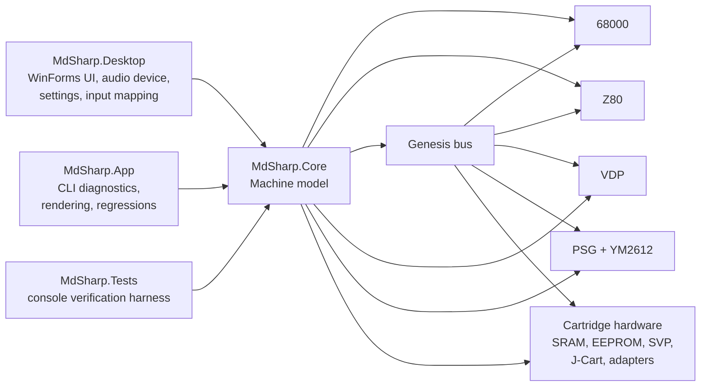

# Architecture

mdSharp is split into three main projects:

- `MdSharp.Core`: emulation core with no UI dependency
- `MdSharp.App`: command-line diagnostics, rendering, compatibility, and regression tools
- `MdSharp.Desktop`: WinForms frontend for interactive play

The intended dependency direction is:

```text
MdSharp.Desktop  ->  MdSharp.Core
MdSharp.App      ->  MdSharp.Core
MdSharp.Tests    ->  MdSharp.Core
```



`MdSharp.Core` should remain usable from any frontend. UI, file dialogs, Windows Forms, audio devices, and desktop settings belong outside the core.

## Core Runtime

`MegaDrive` is the top-level runtime object. It owns:

- cartridge image and cartridge hardware state
- 68000 CPU
- Z80 CPU
- Genesis bus
- VDP
- PSG
- YM2612
- scheduler and frame timing state
- audio mixer state

Frame execution is scanline-based. The scheduler exposes master-clock, 68000, and Z80 timing for NTSC/PAL frames; `MegaDrive` runs active-display and HBlank CPU slices separately so VDP status, HV counter reads, light-gun checks, and DMA debt line up with a fixed per-line beam position. The instruction count passed to `RunFrameCycles` is now a frame-level safety guard rather than the normal source of frame timing.

The runtime also models a few shared bus timing costs. 68000 accesses to peripheral regions such as VDP ports, YM2612 ports, controller IO, the Z80 area, and cartridge-hosted hardware writes can add pending wait cycles that are charged back to the current CPU slice. VDP data-port writes add extra wait cycles when the FIFO is full. Z80 bus requests have a delayed grant window, so the Z80 only sees the bus as granted once the modeled grant time has elapsed rather than immediately when the 68000 writes the request bit.

VDP interrupt delivery is split by interrupt type. VBlank requests are queued so a masked level 6 interrupt can still be delivered if the CPU unmasks it while the VDP pending flag is still active. HBlank requests are delivered at the scanline event without creating stale masked requests. When the 68000 accepts a level 4 or level 6 interrupt, the VDP pending flag is acknowledged so the same request is not repeatedly serviced.

Typical frontend flow:

1. Load a `CartridgeImage`.
2. Create a `MegaDrive`.
3. Reset or restore state.
4. Set controller button state before each frame.
5. Run one frame.
6. Render video and audio samples.
7. Persist SRAM or save state when needed.

## Design Principles

- Keep the core deterministic. Given the same ROM, save data, settings, and input movie, the same frame should produce the same video, audio, and machine state.
- Keep frontend responsibilities at the edge. Desktop code handles menus, input devices, audio playback, files, and presentation; the core handles hardware behavior.
- Prefer hardware-shaped fixes. Game-specific diagnostics are useful, but compatibility fixes should normally explain a VDP, CPU, bus, cartridge, or audio behavior.
- Make bugs replayable. A frame number, screenshot, trace, or input movie is much more valuable than a one-off visual report.
- Use generated output as evidence, not source. Screenshots, WAVs, traces, ROMs, saves, and dashboards stay local unless there is a deliberate reason to publish a sanitized artifact.

## CPU And Bus

The 68000 and Z80 execute through the Genesis bus. The bus is responsible for mapping:

- cartridge ROM and mapper behavior
- work RAM
- Z80 RAM and banked 68k access
- VDP data/control ports
- controller IO
- PSG writes
- YM2612 address/data/status ports
- SRAM/EEPROM access
- SVP DRAM, host registers, cell-arranged reads, and SSP1601 execution for Virtua Racing

The bus also records observer events for diagnostic traces. Bus timing state is part of save states so restored sessions resume with the same pending Z80 grant and VDP wait-cycle behavior.

## Video

The VDP owns VRAM, CRAM, VSRAM, registers, DMA state, FIFO behavior, scanline snapshots, and frame rendering.

The renderer is designed around raster-sensitive games. During emulation it captures enough per-line state to render:

- plane A and plane B
- window plane
- sprites
- horizontal and vertical scrolling
- CRAM changes
- VSRAM changes
- display enable/blanking
- interlace modes
- shadow/highlight
- split-screen and per-line viewport behavior

The desktop frontend asks the VDP to render into a BGR frame buffer for display. CLI tools can write PPM/BMP screenshots.

The most important video design choice is that rendering is driven by captured per-line state rather than a single end-of-frame register snapshot. Many of the compatibility targets that shaped mdSharp depend on mid-frame changes: Sonic 2 split-screen viewports, Streets of Rage HUD timing, Toy Story and Aladdin sprite-pattern DMA, Castlevania palette changes, and Virtua Racing layout behavior.

## Audio

Audio is generated by the PSG and YM2612, then mixed by `MegaDrive`.

Important pieces:

- PSG tone/noise channels with frame-timestamped writes
- YM2612 FM channels, DAC channel, timers, key-on state, panning, channel 3 special mode, detune, SSG-EG, LFO, and frame-timestamped writes
- output filters and soft limiting in `AudioConstants` and `MegaDrive`
- stem and trace helpers in `MdSharp.App` for audio diagnostics

The current YM2612 implementation is intentionally practical rather than bit-perfect. It has been tuned against reference recordings, but envelope and output table accuracy remain important future work.

## Input

The core exposes Genesis controller ports with three-button behavior by default and optional six-button pad handshaking. The desktop frontend maps keyboard and XInput gamepads to four player slots; players 3 and 4 are used by cartridge-hosted input hardware such as J-Cart. Port 1 can also be switched to Sega Team Player or EA 4-Way Play multitap adapters. Port 2 can expose Menacer or Konami Justifier light gun behavior, including mouse-driven screen position and an approximate HV latch for beam hit timing.

Input movies store:

- ROM name and ROM SHA-256
- optional initial SRAM snapshot
- per-frame player 1 and player 2 inputs

This allows a user-observed issue at a specific frame to become a repeatable regression case.

## Save Data

Cartridge save RAM and EEPROM live in the core cartridge layer. The desktop frontend persists save data next to the ROM through `SramStore`.

Save states use `SaveStateSerializer` and capture CPU, bus, cartridge, VDP, audio chip, scheduler, controller, and mixer state.

## CLI Diagnostics

`MdSharp.App` is intentionally broad. It contains tools for:

- ROM smoke tests
- frame rendering
- compatibility dashboards
- movie regression
- visual checkpoints
- audio dumps and audio comparisons
- VGM rendering/stems
- CPU, Z80, VDP, IO, and audio traces
- targeted game diagnostics used during development

The CLI is not a stable public API yet. Prefer documenting important workflows in `docs/CLI.md` when commands become part of normal development.

## Documentation Map

- Use [CLI.md](CLI.md) for command syntax and diagnostic workflows.
- Use [TESTING.md](TESTING.md) for the regression strategy and what to run after each type of change.
- Use [COMPATIBILITY.md](COMPATIBILITY.md) for game-focused status and triage.
- Use [AUDIO.md](AUDIO.md) and [AUDIO_REFERENCES.md](AUDIO_REFERENCES.md) for YM2612/PSG tuning and reference capture.
- Use [SHOWCASE.md](SHOWCASE.md) for the local screenshot gallery.
- Use [RELEASE.md](RELEASE.md) before publishing the repository or cutting a binary build.
