# Showcase

This document describes the screenshot gallery used to sanity-check mdSharp visually. A curated set of PNGs is committed under `docs/assets/showcase/` so the README and GitHub docs render correctly. The larger regression outputs that feed these images still live under `render-output/` and remain ignored by git.

To refresh the committed gallery after running the release gate or visual checkpoints:

```powershell
powershell -ExecutionPolicy Bypass -File tools\build-showcase-gallery.ps1
```

The script converts selected release-gate BMP screenshots into PNG files under `docs/assets/showcase/` and writes a local manifest to `render-output/showcase/showcase-manifest.csv`.

## Composite Panels

The README uses two committed composite panels for the first visual impression of the emulator. These are curated from the per-game showcase images and are not regenerated by `tools/build-showcase-gallery.ps1`.

| Panel | Contents | Image |
| --- | --- | --- |
| Composite 1 | Sonic the Hedgehog, Sonic the Hedgehog 2 split-screen, Streets of Rage, Virtua Racing | 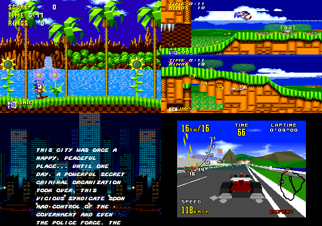 |
| Composite 2 | Castlevania: Bloodlines, Sonic the Hedgehog 3, Disney's Aladdin, Disney's Toy Story | 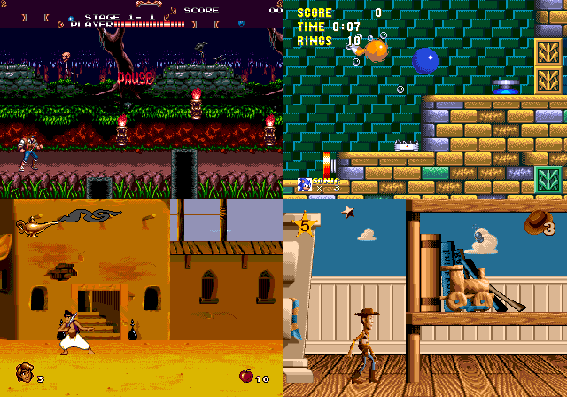 |

## Gallery

| Scenario | What it demonstrates | Local image |
| --- | --- | --- |
| Sonic the Hedgehog | baseline gameplay, sprites, scrolling planes, palette, audio-driver boot path | 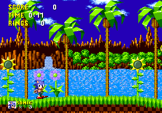 |
| Sonic the Hedgehog 2 | two-player split-screen viewports, per-line scroll/viewport state, duplicated HUD and sprites | 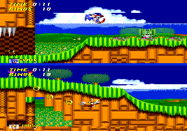 |
| Sonic the Hedgehog 3 | special-stage and water/special rendering regressions around scrolling and sprite placement | 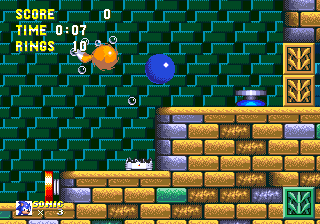 |
| Streets of Rage | intro sequence, HUD alignment, text scrolling, Z80/audio-driver timing | 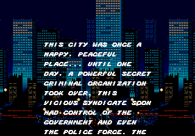 |
| Castlevania: Bloodlines | cutscene/gameplay palette behavior, sprite rendering, shadow/highlight-sensitive scenes | 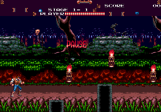 |
| Disney's Aladdin | DMA/sprite-pattern update timing, animated Genie intro path, gameplay sprite integrity | 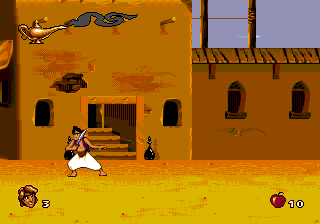 |
| Disney's Toy Story | intro bitmap/logo behavior and animated sprite-pattern updates |  |
| Disney's Toy Story gameplay | scrolling playfield, character sprites, and ordinary retail-game playability after the intro fixes | 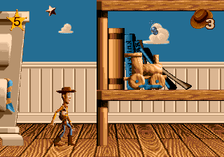 |
| Aladdin Genie logo | short-lived sprite animation corruption regression around the first 600 frames | 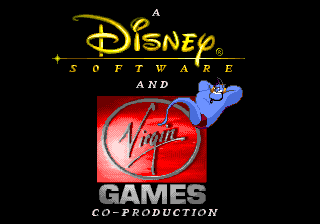 |
| Virtua Racing | SVP cartridge path, SSP1601 execution, 3D road/objects, and timing-sensitive layout checks | 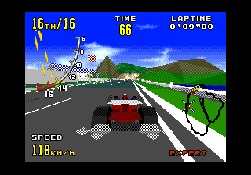 |

## Regenerating From Scratch

The gallery assumes the release-gate visual checkpoints already exist. To rebuild from scratch, run:

```powershell
powershell -ExecutionPolicy Bypass -File tools\run-release-gate.ps1 -SkipAudio -SkipPerf
powershell -ExecutionPolicy Bypass -File tools\build-showcase-gallery.ps1
```

Retail ROMs, `svp.bin`, and generated regression outputs remain local-only. Only the curated PNGs in `docs/assets/showcase/` are intended for the public documentation.
