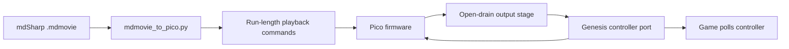

# Pico Playback Plan

## Research Notes

mdSharp movies:

- `src/MdSharp.Core/Input/InputMovie.cs` loads version 1 or 2 JSON, sorts
  frames by `frame`, normalizes legacy `buttons`, and exposes button state by
  `frame - initialFrame`.
- `src/MdSharp.Core/Input/GenesisButton.cs` defines the exact bit masks used by
  the converter.
- `src/MdSharp.Core/Input/ThreeButtonController.cs` already documents the
  active-low TH-select mapping mdSharp emulates, including its six-button
  signature and extra-button phases.

External protocol references checked:

- RaspberryField's 3-button write-up gives the DB-9 pinout and TH-low/TH-high
  button multiplexing:
  https://www.raspberryfield.life/2019/02/15/sega-mega-drive-genesis-3-button-abc-controller/
- RaspberryField's 6-button write-up shows rapid TH pulse behavior and measured
  pulse timing:
  https://www.raspberryfield.life/2019/03/25/sega-mega-drive-genesis-6-button-xyz-controller/
- Sega Retro notes the six-button controller resets its extended state if a TH
  rising edge is not seen within about 1.5 ms:
  https://segaretro.org/Six_Button_Control_Pad_(Mega_Drive)
- The University of Alberta app note emphasizes that button states should be
  held for at least one video frame so the console cannot miss them:
  https://sites.ualberta.ca/~delliott/cmpe490/appnotes/2016w/g6_genesis_controllers/genesis_controller.pdf
- Raspberry Pi's RP2040 datasheet is the baseline reference for GPIO limits and
  is why the first schematic level-shifts TH and avoids raw 5 V on Pico pins:
  https://datasheets.raspberrypi.com/rp2040/rp2040-datasheet.pdf
- The schematic now treats a 3.3 V / 5 V logic level converter as a required
  component for the first prototype so Pico GPIO never touches raw Genesis
  controller-port voltage.

## Target Architecture



The controller port does not expose VBlank, so playback timing must be based on
the Pico clock. Each command is held for whole movie frames. The user starts the
movie from a known console state, ideally power-on or reset, with optional idle
lead-in frames for alignment.

## Milestones

1. Converter and command format

   `mdmovie_to_pico.py` is the initial converter. It exports a C header, JSON,
   or CSV. The C header form is intended to be compiled into Pico firmware:

   ```c
   typedef struct {
       uint32_t frames;
       uint16_t buttons;
   } MdMovieCommand;
   ```

2. Three-button firmware prototype

   `firmware/` now contains the first Pico C SDK firmware prototype. It:

   - initializes six data GPIOs for direct 3.3 V / 5 V level-shifter output;
   - reads TH/select through the level-shifted input;
   - applies the current movie mask using the three-button table;
   - advances commands at `60 / 1.001` Hz for NTSC or `50` Hz for PAL;
   - provides a USB serial command such as `arm`, `start`, `pause`, and `status`.

   The command names implemented are `start`, `pause`, `reset`, `status`, and
   `help`, with short aliases.

3. Hardware bring-up

   - Test the open-drain board without a console using 5 V pull-ups and a logic
     analyzer.
   - Connect only TH input and ground to a Genesis first, verify TH levels and
     polling cadence.
   - Connect one data line, verify active-low response, then connect all data
     lines.
   - Test with a simple ROM/menu action before attempting a full mdSharp movie.

4. Six-button support

   Add the same handshake state machine as mdSharp:

   - normal high and low phases for Up/Down/Left/Right/A/B/C/Start;
   - signature phase with D0-D3 low;
   - extra-button phase mapping D0-D3 to Z/Y/X/Mode;
   - reset the handshake state after roughly 1.5 ms without the expected rapid
     TH transition.

5. Synchronization polish

   The weak point is start alignment, not per-frame command conversion. Add:

   - configurable idle lead-in frames;
   - optional physical start button on the Pico;
   - optional USB serial countdown;
   - PAL/NTSC selection;
   - movie metadata printed over USB serial so the user can confirm the ROM and
     expected region before playback.

## Open Questions

- Should the first firmware load command files from flash only, or should it
  also accept a streamed USB serial command list?
- Should the root mdSharp app eventually export a Pico-ready file directly?
- For long movies, do we need a hardware sync source beyond fixed frame timing?
  The controller port alone does not provide one, but the Pico clock should be
  adequate for short and medium movies.
- Should the final hardware use discrete FETs, a transistor array, or a
  purpose-built open-drain buffer IC for easier assembly?
